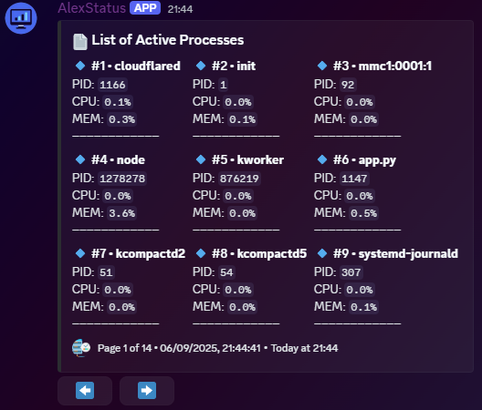

# 🖥️ Discord System Monitor Bot

[](LICENSE)

A lightweight Discord bot designed to monitor system stats from a Raspberry Pi 5 (or any Linux-based machine). The bot periodically sends a live system status update to a selected Discord channel, including CPU load, memory usage, temperature, disk usage, and uptime.

## ✨ Features

- Live system stats updated in real time
- Details include:
  - 🧠 RAM usage
  - 🔥 CPU temperature
  - ⚙️ CPU usage
  - 💾 Disk space used
  - ⏱️ System uptime
  - `/htop` command to display an interactive process list directly in Discord (like the Linux `htop`)

## 💻 `/htop` Command

Use the `/htop` command to view a live list of the most resource-intensive processes on your machine.

- Shows unique processes sorted by CPU usage
- Displays:
  - 🔹 PID
  - 🖥️ CPU usage
  - 📊 Memory usage
- Includes interactive buttons to navigate between pages
- Output is styled to be Discord-friendly and readable



## 📦 Requirements

- Node.js 18 or higher
- A Discord bot token
- A Raspberry Pi 5 (or any Linux system with `/proc` access)

## 🔧 Setup

1. Clone the repository:

```
git clone https://github.com/ItsAlexIK/CoreWatch.git
cd CoreWatch
npm install
```

2. Create a `.env` file in the project root with the following content:

```
DISCORD_TOKEN=your-discord-bot-token
DISCORD_CLIENT_ID=client_id_here
DISCORD_GUILD_ID=guild_id_here
DISCORD_CHANNEL_ID=your-discord-channel-id
```

3. Run the bot:

```
node index.js
```

## 📬 Connect 

- [Discord](https://discord.com/users/551023598203043840)
- [GitHub](https://github.com/ItsAlexIK)

---

> Made with ❤️ by ItsAlexIK
